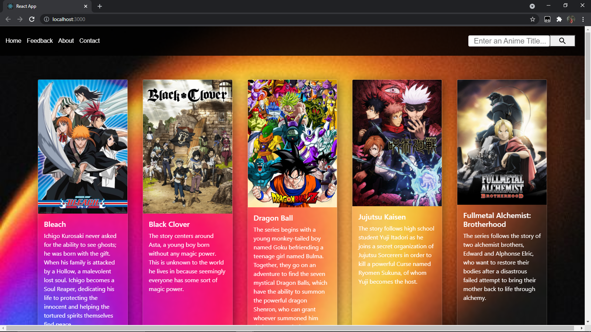

# Search & Filter Cards

An anime webpage using react js and hooks that automatically searches and filters the anime title.


## Features

- Bootstrap Card Hover Zoom in/out Effect
- Glassmorphism Card

  
## Run Locally

Clone the project

```bash
  git clone https://github.com/hyaxsuzy/Search-App.git
```

Go to the project directory

```bash
  cd search-app
```

Install dependencies

```bash
  npm install
```

Start the server

```bash
  npm run start
```

  
## Installation

Install application with npm

```bash
  npm install search-app
  cd search-app
```
Install the packages in your project directory with npm

```bash
  npm install bootstrap
  npm install @mui/icons-material
```
## Screenshots



  
